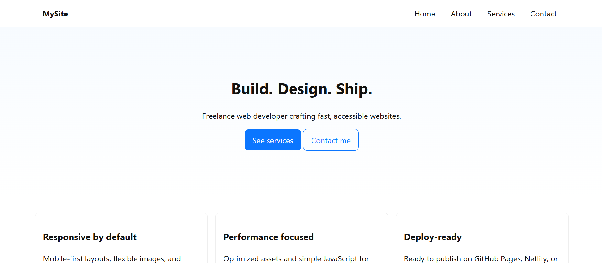

# My Website – Portfolio Project
This is my final web development assignment — a fully responsive, multipage portfolio website built with HTML5, CSS3, and JavaScript. It showcases my work, provides information about me, and lets users get in touch.

# Project Structure
my-website/
├── index.html       # Home page ( features, recent work)
├── about.html       # About me page (bio, skills)
├── services.html    # Services offered (service cards)
├── contact.html     # Contact form page
├── css/
│   └── styles.css   # Site styling
├── js/
│   └── main.js      # Navigation toggle, form handling
├── images/          # Avatar and project images
└── assets/
    └── favicon.ico  # Favicon
    
# Features
•	Responsive Design – Works on desktop, tablet, and mobile
•	Reusable Header/Footer – Consistent navigation across all pages
•	Interactive Elements – Mobile menu toggle, contact form with HTML5 validation
•	Organized Codebase – Clean folder structure with semantic HTML
•	Deploy-Ready – Hosted on GitHub Pages

# Pages Overview
•	Home – Hero section, highlights, recent work/projects
•	About – Personal bio, skills list
•	Services – Overview of offerings with call-to-action buttons
•	Contact – Contact form for users to send messages

# Tech Stack
•	HTML5 – Semantic and accessible structure
•	CSS3 – Responsive layout, styling
•	JavaScript (Vanilla) – Menu toggle, form behavior

# Live Demo
 View here: https://lagat24.github.io/my-website/
 
# Local Development
To run locally:
1.	Clone the repo:
git clone https://github.com/lagat24/my-website.git
2.	Open index.html in your browser.

# Best Practices Followed
•	 Proper folder structure (/css, /js, /images)
•	 Clean and commented code
•	 Mobile-first responsive design
•	 Accessible markup with aria- attributes and alt text
•	 Live deployment on GitHub Pages

# Preview

# License
This project is for educational purposes.
